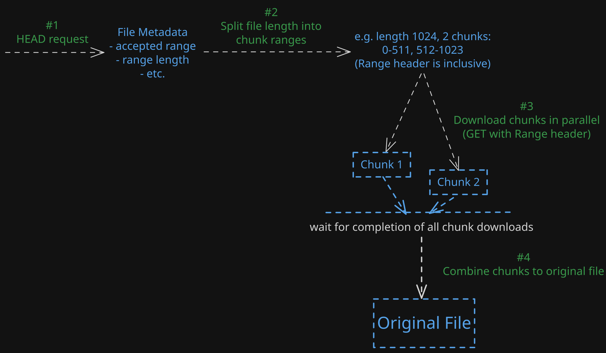

# Parallel File Downloader

[](https://github.com/darius-it/parallel-file-downloader/actions/workflows/run-tests.yml)

A simple tool to download files from a web server in chunks (using the `Range` header) which are downloaded in parallel.
This implementation builds on a previous submission, but has been significantly rewritten, including many improvements
discussed in the last interview.

(The old README with some more details on the initial implementation can be found
in [the README_old.md](docs/README_old.md).)

General logic of the downloader:


## How to use

Prerequisite is a web server which supports downloading in chunks using the `Range` header (so for example an Apache web
server pointed to serve some files to be downloaded).

The downloader logic is exposed through the `downloadFile()` method of a `Downloader` object.

In our example app, we use an `AppContainer` which uses Dependency Injection to pass the required dependencies (Ktor
HTTP Client and logger) to a Downloader object. You can obtain and object and use it as follows:

```kotlin
val container = AppContainer()
val downloader = container.getDownloaderInstance(/* optional params for serverUrl and parallelDownloadChunks*/)

downloader.downloadFile(
    "someFileName.png", // file name to download
    "http://localhost:3210", // server URL, defaults to http://localhost:8080
    4, // # of chunks to download in parallel, defaults to 2
)
```

If you want to manually create a `Downloader` object, you can configure it as follows:

```kotlin
val customDownloader = Downloader(
    defaultServerUrl = "http://localhost:8080",
    parallelChunkAmount = 2,
    chunkFailureRetries = 3,
    httpClient = HTTPClient(/* ... */), // some Ktor HTTPClient implementation,
    logger = KLogger(/* ... */) // some implementation of KotlinLogger
)
```

## Improvements compared to previous implementation

- Using streaming approach for chunk downloads. Streaming directly from Ktor's ByteReadChannel into the destination file (via FileChannel and a small direct buffer), avoiding large in‑memory byte arrays and enabling downloads of larger files.
- Used Dependency Injection in Downloader for looser coupling with dependencies. For simplicity purposes a lightweight manual approach was used (see `AppContainer`), but it still offers the same advantage that our app has one instance of a Ktor HTTP client and a logger we can inject into any downloader object, but if we want we can still configure a downloader manually with different dependencies passed.
- Refactored functions into smaller logical units. In the old downloader there were only a few methods with more logic inside them. While the code itself was clean and the methods were not excessively big, some refactoring was done to improve the logical flow of the implementation and provide smaller, more isolated units that can be tested better.
- Added custom exceptions to differentiate between different failure states of the download logic. 
- Created a simple wrapper method to retry a code snippet if we hit certain exceptions that we deem "retryable". Depending on the severity of the error, this could mean retrying a chunk or retrying the entire download process (here only chunk downloads have the retry implemented).

## Further potential extensions

- Instead of requiring particular instances of a Ktor HTTP Client or a KotlinLogging logger object, add some general interfaces for the required methods to allow using different libraries for our downloader dependencies. (This could theoretically be circumvented by writing adapters for those libraries, but a more general approach would be nicer.)
- Test coverage could probably be improved a little, now that the main downloader methods are smaller isolated units we could test a few more cases.
- Some benchmarking could be done to see if there's any speed bottlenecks. Aspects like memory usage could also be inspected, depending on what our requirements are.
- In a production setting (especially in something like a Compose app), it would most likely make more sense to use Koin for Dependency Injection because it provides good abstractions for DI that integrate well with other libraries (e.g. Android ViewModels).
- Implement retry logic for network-related issues using Ktor's retry logic and potentially catch more severe failures to optionally retry the entire download process once.